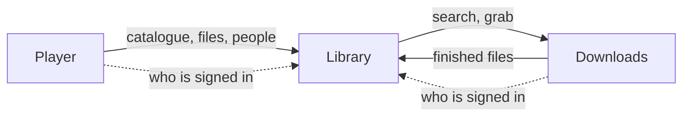
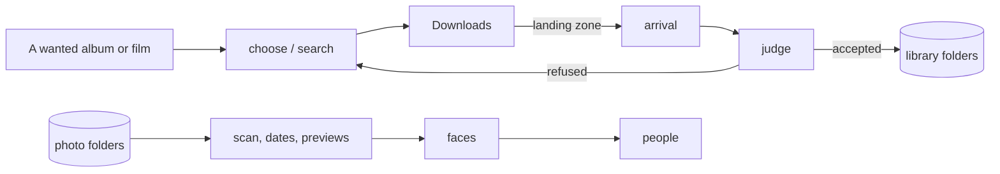

# OPUS · Library — Architecture

Library is the part of OPUS that knows what exists: the music, films, series,
web video and photographs a household keeps, and the people in them. It
decides what is worth acquiring and whether what arrived is what was wanted,
and it leaves the fetching to OPUS · Downloads. One backend process serves the
API and runs the pipelines; Postgres keeps the catalogue.

## Place in the suite

OPUS is three modules that divide the work. **Library** knows what exists and
judges it; **Downloads** fetches and decides nothing; **Player** plays and
keeps only where each person stopped. Library also holds the roster of users
for all three. Each module is its own repository and its own set of
containers, and they talk over HTTP, each with its own token.



The whole suite installs with two server roles: a storage server with Library
and Downloads, and a playback server with Player.

## Principles

- **Library judges, Downloads fetches.** Which release is worth taking,
  whether an album is complete and whether a film's subtitles meet the policy
  are Library's decisions. Downloads only reports that a file has landed.
- **Acceptance is verified, never assumed.** An album is complete when every
  track of the chosen edition is on disk at the quality asked for; a film is
  complete when ffprobe finds the subtitle languages the policy requires. A
  partial result is never marked complete.
- **One canonical source per domain.** Deezer for music, with Wikidata settling
  an artist's identity; TMDB for films and series. Other sources add detail but
  never decide identity.
- **Photographs are read in place.** Library never copies or moves a
  photograph; it keeps derivatives (previews) of its own beside them.
- **Settings live in the database.** Only infrastructure is in `.env`; paths,
  naming, quality, the subtitle policy and the accounts are edited on the
  Settings page.
- **Plugins add, the core stays whole.** An installation can add sources and
  channels as plugins. A plugin that is named and cannot be loaded stops the
  start rather than leaving a silent gap.

## Components

| Component | Role |
|---|---|
| `backend` | FastAPI: the API, the roster and sign-in, and the pipelines, which run as tasks in the same process |
| `frontend` | SvelteKit interface: library, search, downloads, settings |
| `faces` | Face detection and embedding on an Intel GPU through OpenVINO; holds no state and decides nothing about who anybody is |
| `postgres` | Postgres 18 |

## Data flow



**Music and video.** A wanted item goes through the phases of its pipeline:
choose a release (asking Downloads to search), grab it under Library's own
namespace, follow the download, then judge what arrived and file it. Music is
matched against the edition, tagged and named; a film or episode is probed,
checked against the subtitle policy, completed with missing subtitle languages
and named. A refused result sends the pipeline to the next candidate. Folders
left in the landing zone by imports that never happened are cleared on a
schedule.

**Photographs.** A pass finds new files, reads their dates and places, renders
previews, asks `faces` for boxes and vectors and gathers the vectors into
people. Each step skips what it has already done, so the pass is cheap when
nothing has changed.

## Storage

| Store | Holds |
|---|---|
| Postgres | Catalogue (music, video, photographs), people, users and sessions, settings |
| Library folders | Music, films, series and web video, named by the templates in Settings |
| Photo folders | The photographs, mounted read-only |
| Derivatives | Previews, which `faces` reads directly |
| Vault | Each user's encrypted pictures, one opaque file per picture |
| Landing zone | Finished downloads, shared with Downloads |

Schema changes are Alembic migrations, applied when the backend starts.

## Interfaces

- **HTTP API** under `/api` for the interface and the other modules.
- **Downloads**, for every search, grab and job status.
- **Metadata services:** Deezer, Spotify, Discogs, Wikidata and MusicBrainz for
  music; TMDB and OpenSubtitles for video.
- **Player** reads the catalogue, the files and the people from Library on the
  spot and keeps no copy.
- **BABA** can take reference photos of a household's people from Library to
  recognise them on camera.

## Security

One middleware covers every route. A person signs in once in the browser and
carries a session cookie; a module (Player, Downloads, BABA) carries its own
token on every call. Library keeps the roster the other modules check against,
and `opus_auth` defines the credentials all three read the same way. A vault
is opaque to the server: it holds no vault key and cannot derive one, and a
picture is decrypted only when its owner hands over the key to open it.

## Deployment

Library runs in containers from `docker-compose.yml`; the `faces` service
belongs to the `faces` profile and runs only where the Intel GPU is.
`install.sh` installs Library on its own; `suite/install.sh`, from the bundle
`scripts/package-suite.sh` builds and `deploy/release.sh` attaches to each
GitHub release, installs the storage server with Downloads beside Library and
writes the enrollment file the playback server is installed with.

## Extending

- **A plugin:** a directory under the path `OPUS_PLUGINS` names, with an
  `opus-plugin.toml` that points the `opus-library` module at the object it
  hands Library (see `backend/opus/plugins.py`). Its dependencies are installed
  from `requirements/opus-library.lock` when the image is built.
- **A metadata source:** a module beside the existing ones under
  `backend/opus/music/metadata` or `backend/opus/video/metadata`.

## Repository layout

```
backend/opus/         the Library application
  acquire.py          the one address the library acquires through
  api/routers/        system, downloads, music, video, photos
  models/             accounts, music, video, photos, people, vault
  music/ video/ photos/
backend/opus_core/    shared with the other modules (submodule)
backend/opus_auth/    the credential contract (submodule)
backend/alembic/      migrations
faces/                the face inference service
frontend/src/
  lib/opus/           shared by the OPUS modules (submodule opus-ui)
  lib/kit/            the UI kit shared with BABA and DIDA (submodule ui-kit)
  lib/music/ lib/video/ lib/photos/
  routes/             library, search, downloads, settings
suite/                the suite installer and the demo portal
scripts/              suite and release packaging
deploy/               backups, recovery drill, demo
install.sh            installer for Library on its own
```
