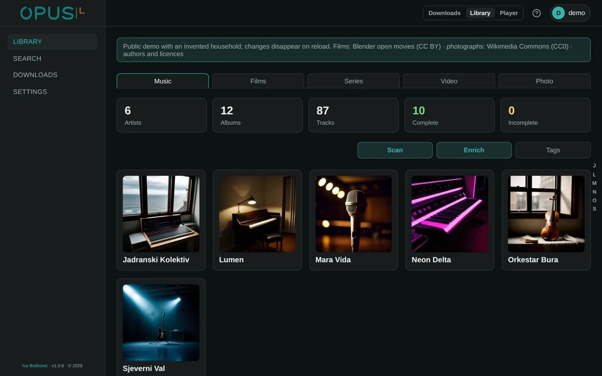
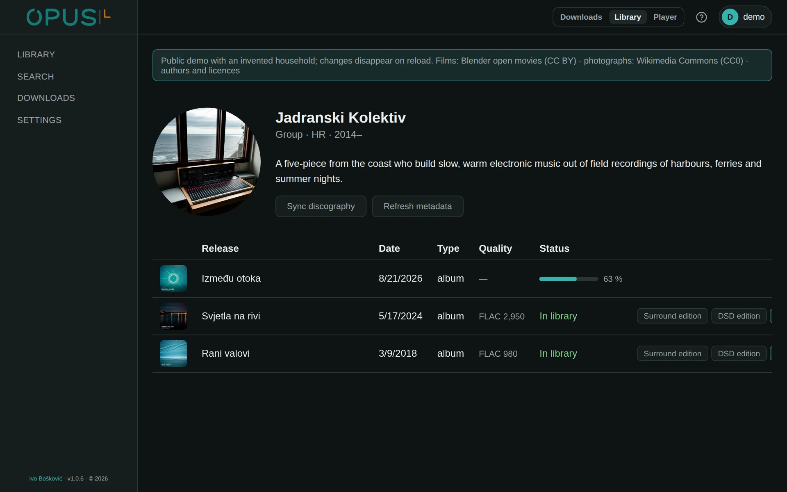
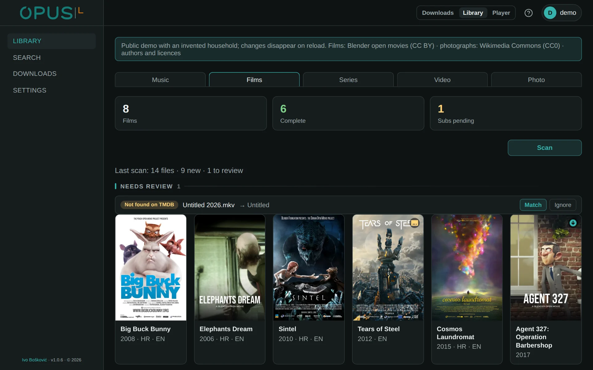
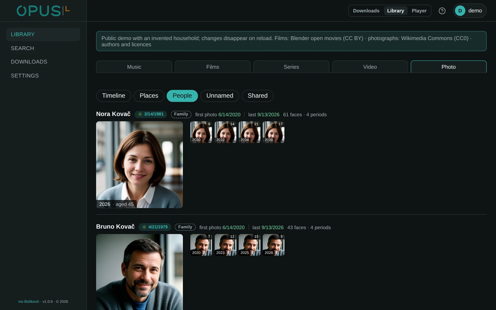

# OPUS · Library

**One library for music, films, series, web video and photographs.**

OPUS is a household collection of music, films, series, web video and
photographs in three modules. Library decides what is worth having, what counts
as having it and what a file is called;
[Downloads](https://github.com/Bacinac/opus-downloads) acquires it from every
source behind one interface; [Player](https://github.com/Bacinac/opus-player)
plays it on whatever it runs on: a television, a phone or a DAC. Each module is
an application of its own, with its own address and its own release; they share
the sign-in, the look and the words.

**Try it:** [demo-opus-library.boskovic.biz](https://demo-opus-library.boskovic.biz), the real interface with a made-up household inside.

<p align="center"></p>

<details>
<summary>More screenshots</summary>

**Music:** the artists on the shelf and how complete their records are.


**Artist:** every release with its date, quality and editions, and what is still on its way.



**Films:** every film with its audio and subtitle languages, and a file still waiting to be identified.



**People:** each person through the years, from the faces the library has grouped.



</details>

## What it does

It follows artists and series and knows what has newly come out. For every
release it decides whether it is worth taking and whether all of it arrived: an
album whole and at the quality asked for, a film with subtitles that pass the
check. It imports, names and files what lands, then says what is missing.
Photographs stay where they are: the catalogue reads them in place, recognises
faces and gathers them into people across the years, and each user has a
private encrypted vault of their own.

## What sets it apart

The kinds share their verbs and none of their nouns: following, acquiring,
importing and "what is missing" are the same for all of them, but each speaks
its own vocabulary. An install with only music is a music app; a kind appears
only once its library tree is really mounted. An artist's identity is never
bought with a search score, and the title on a file stays the one its tag
carries.

## How it works

**Music.** Deezer is canonical, Spotify and Discogs are secondary, Wikidata
settles an artist's identity, and MusicBrainz is used only as evidence of an
edition, never as identity. Acceptance is the edition: complete, at the quality
asked for; a partial album is never green.

**Films and series.** TMDB is canonical. Subtitles are the acceptance test: a
file is imported and watchable at once, but it is not green until the subtitle
policy (`any:en,hr` by default) is met, verified with ffprobe rather than
assumed from the release name.

**Photographs.** Read in place, never copied. Faces are detected and embedded
on an Intel GPU and gathered into people; a vault is encrypted per user.

Everything acquired goes through OPUS · Downloads, and Library keeps one queue
for everything in flight. Only infrastructure lives in `.env`; the address of
Downloads, library paths, naming templates, quality, the subtitle policy and
the accounts are edited on the Settings page and kept in Postgres. The system
map is in [ARCHITECTURE.md](ARCHITECTURE.md).

## Technology

Python 3.14, FastAPI and SQLAlchemy 2.1, Postgres 18, SvelteKit 2 and Svelte 5.
Music: Deezer, Spotify, Discogs and Wikidata, with MusicBrainz only as evidence
of an edition. Video: TMDB and OpenSubtitles. Faces: AdaFace on OpenVINO, on an
Intel GPU. Everything runs in containers.

## Install

OPUS needs Docker with Compose v2, `python3`, `curl` and about 4 GiB of free
space before media.

The whole of OPUS installs as one suite with two server roles: Library and
Downloads on the storage server, Player on the playback server beside the GPU,
the HDMI output and the DAC. Download `opus-suite-<version>.tar.gz` from the
[latest release](https://github.com/Bacinac/opus-library/releases/latest),
unpack it and follow its README, the same as [suite/README.md](suite/README.md):

```bash
tar xzf opus-suite-<version>.tar.gz
cd opus-suite-<version>
./install.sh --role=all        # one box; production splits library-downloads and player
```

The bundle also carries the signed OPUS TV and OPUS Music apps for Android,
which the release offers on their own as well.

Library on its own:

```bash
git clone --recurse-submodules https://github.com/Bacinac/opus-library.git
cd opus-library
./install.sh
```

The installer generates the secrets, creates storage, starts the stack and
creates the first administrator, whose login is written once to
`.install-admin` with mode `0600`. The interface is on port `5280`. Existing
media folders and the rest are in [docs/INSTALL.md](docs/INSTALL.md).

## Upgrade

```bash
git pull --recurse-submodules
./install.sh
```

The installer is idempotent: it rebuilds and restarts, and keeps every secret,
the database and the media.

## Development

```bash
docker compose up -d
```

Backend on `:8095`, interface on `:5280`, Postgres only inside the compose
network. With `OPUS_UI_TARGET=dev` and `OPUS_DEV_RELOAD=1` in `.env`, code
changes are live without a restart. `./check.sh` runs every check and test.

The public demo is the real interface over fictional data held in the browser;
`frontend/build-demo.sh` builds it, see [docs/DEMO.md](docs/DEMO.md).

## License

OPUS · Library is licensed under
[PolyForm Noncommercial 1.0.0](LICENSE.md): free for personal and
non-commercial use. Commercial use requires a separate license; write to
[ivo.boskovic.zg@gmail.com](mailto:ivo.boskovic.zg@gmail.com). External
contributions (pull requests) are not accepted.

Required Notice: Copyright (c) 2026 Ivo Bošković

The face models that `faces/entrypoint.sh` downloads (the antelopev2 detector,
InsightFace buffalo_l landmarks, AdaFace IR-101 trained on WebFace12M) are
third-party and licensed for non-commercial research use only; a commercial
license for OPUS does not cover them.
